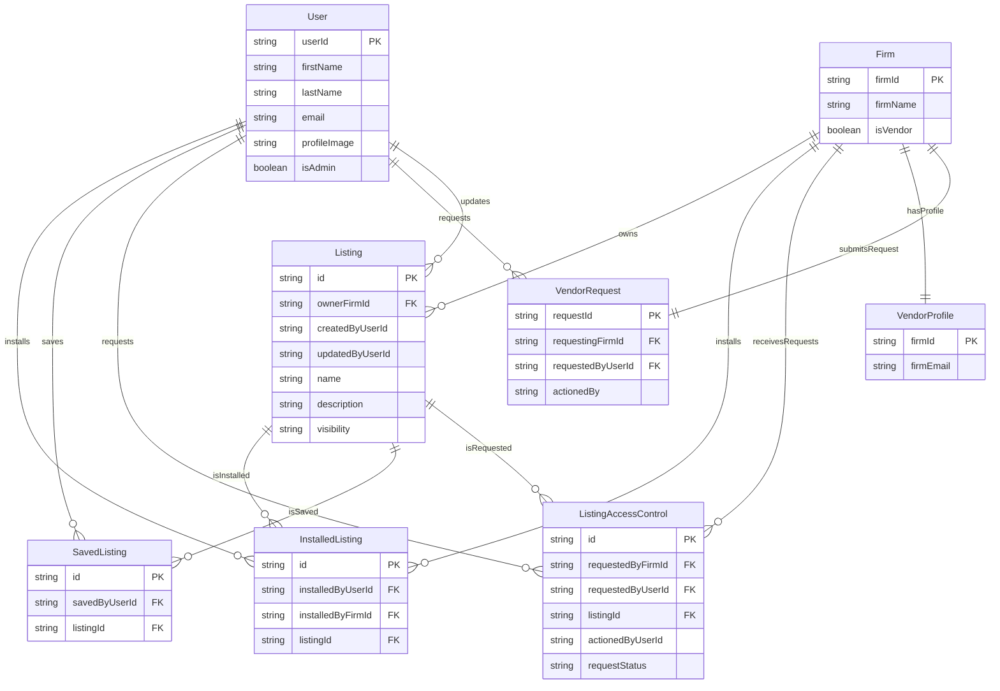

```mermaid
erDiagram

User {
string userId PK
string firstName
string lastName
string email
string profileImage
boolean isAdmin
}

Firm {
string firmId PK
string firmName
boolean isVendor
}

Listing {
string id PK
string ownerFirmId FK
string createdByUserId
string updatedByUserId
string name
string description
string visibility
}

ListingAccessControl {
string id PK
string requestedByFirmId FK
string requestedByUserId FK
string listingId FK
string actionedByUserId
string requestStatus
}

SavedListing {
string id PK
string savedByUserId FK
string listingId FK
}

InstalledListing {
string id PK
string installedByUserId FK
string installedByFirmId FK
string listingId FK
}

VendorRequest {
string requestId PK
string requestingFirmId FK
string requestedByUserId FK
string actionedBy
}

VendorProfile {
string firmId PK
string firmEmail
}

%% Relationships
User ||--o{ InstalledListing : installs
User ||--o{ SavedListing : saves
User ||--o{ ListingAccessControl : requests
User ||--o{ VendorRequest : requests
User ||--o{ Listing : updates

Firm ||--o{ Listing : owns
Firm ||--o{ InstalledListing : installs
Firm ||--o{ ListingAccessControl : receivesRequests
Firm ||--|| VendorProfile : hasProfile
Firm ||--|| VendorRequest : submitsRequest

Listing ||--o{ InstalledListing : isInstalled
Listing ||--o{ SavedListing : isSaved
Listing ||--o{ ListingAccessControl : isRequested
```
