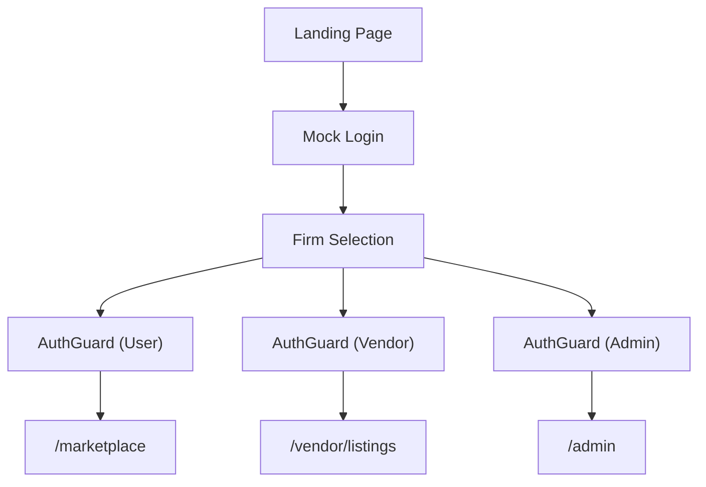
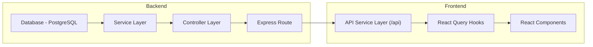

## 🧩 Frontend Overview

### Notes

- React Query used for **all** data fetching and mutations, **axios** for the api/service layer.
- Zustand for global state - check `/store` folder that contains zustand state config, stores the jwt payload and firm details.
- DaisyUI + Tailwind for styling - check `app/globals.css` for style config.
- React Hook Form used for tracking input fields - check `components/input` folder. These components work with both controlled inputs and React Hook Form.
- `.env` file contains image upload–related variables. **Replace the existing ones** with your own.
- Marketplace functionality starts after the landing page. Click any **login button** to simulate login.
- Data is currently **filtered on the frontend** — this should be refactored to backend filtering.
- Add consistent types to the **API layer, component logic, and React Query hooks**.
- **Private Invite** feature for listings is **not yet implemented**.
- Build errors are **ignored in `next.config.ts`** to enable containerization.

---

### 📁 File Structure

#### `hooks/`

- General-purpose helper hooks.
- `useLogin.ts`: Imports mock JWT payloads from `utils/JWT-users.ts` and stores the user in **global state** — see the “understanding mock data” section.
- `useFilteredListings.ts`: Handles filtering logic on the main `/marketplace` route.

#### `hooks/react-query/`

- Custom wrapper hooks for React Query.
- Organized by **domain/feature**.
- Includes **query and mutation** hooks.

#### `lib/`

- Shared config utilities.
- `axiosInstance.ts`: Core to mocked login. Adds request interceptors to:
  - Set the `Authorization` header from global state.
  - Attach the `X-Firm-Id` header.

#### `api/`

- Data-fetching abstraction layer.
- Contains domain-specific API calls using `axiosInstance`.

---

## 🌐 Routing Overview

The application is organized into role-based route groups located in the `src/app` directory:

- `admin` – for admin users
- `vendor` – for content vendors
- `(user-route-group)` – for firm users (marketplace access)

Each route group is protected using a corresponding `AuthGuard` component. After mock login, users select a firm, and access is conditionally granted based on their JWT metadata.

---

### 🗂️ Route Structure Note

- The `(user-route-group)` folder includes:

  - `marketplace` – Main listings page
  - `listing` – Individual listing page
  - `vendor-details` – Public vendor profile

- These routes are currently **authenticated-only** but can be moved to root-level `app/` to make them public-facing if needed.

---

## 🧪 Client-Side Filtering Locations

- `hooks/useFilteredListings.ts`: Filters & paginates data for `/marketplace`.
- `(user-route-group)/installedListings`: Filters listings by `installed` or `requested` status.
- `/vendor/listings`: Filters vendor-created listings by visibility and content type.

---

## 🧩 High-Level Data Flow

