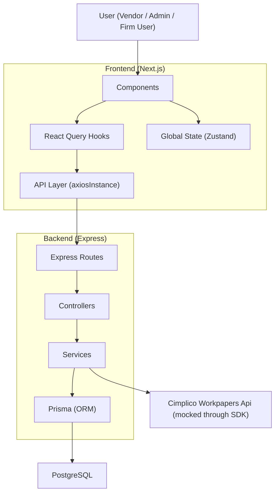

```mermaid
graph TD

%% External Actor
User["User (Vendor / Admin / Firm User)"]

%% Frontend
subgraph Frontend["Frontend (Next.js)"]
Components["Components"]
ReactQuery["React Query Hooks"]
Axios["API Layer (axiosInstance)"]
State["Global State (Zustand)"]
Components --> ReactQuery
ReactQuery --> Axios
Components --> State
end

%% Backend
subgraph Backend["Backend (Express)"]
Routes["Express Routes"]
Controllers["Controllers"]
Services["Services"]
Prisma["Prisma (ORM)"]
Routes --> Controllers
Controllers --> Services
Services --> Prisma
end

%% External Services
DB["PostgreSQL"]
WorkpapersAPI["Cimplico Workpapers Api (mocked through SDK)"]

%% Data Flow
User --> Components
Axios --> Routes
Services --> WorkpapersAPI
Prisma --> DB
```
