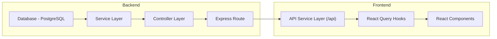

```mermaid
graph LR
  subgraph Backend
    DB["Database - PostgreSQL"]
    DB --> Service["Service Layer"]
    Service --> Controller["Controller Layer"]
    Controller --> Route["Express Route"]
  end

  subgraph Frontend
    Route --> API["API Service Layer (/api)"]
    API --> ReactQuery["React Query Hooks"]
    ReactQuery --> Components["React Components"]
  end
```
