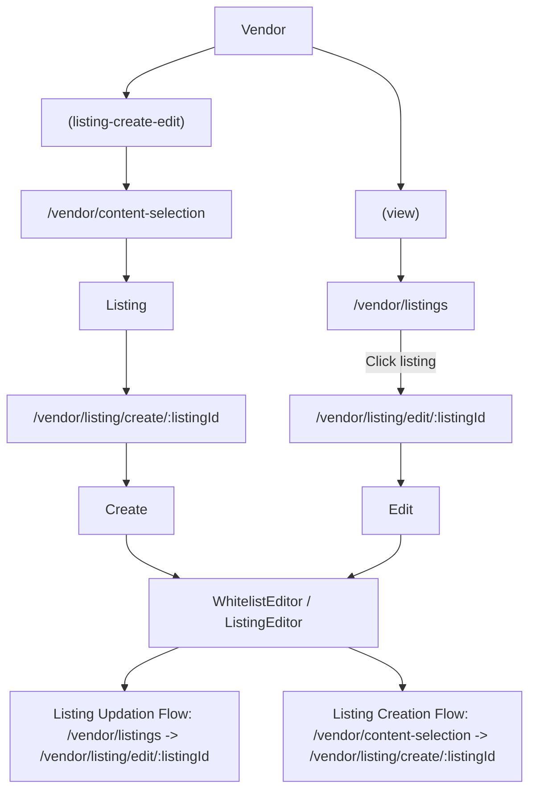

# Listing Create/Update Route Flow

The diagram below shows the route flow for creating and editing a listing. Both Edit and Create pages render the same `ListingEditor` component. The diagram mimics the file/routing structure.  
**Tip:** Open this along with the relevant files (inside the `app/vendor/*` module) for better understanding.  
Also check out the `ListingEditor` component, as it contains logic for pre-filling the form and submission.

